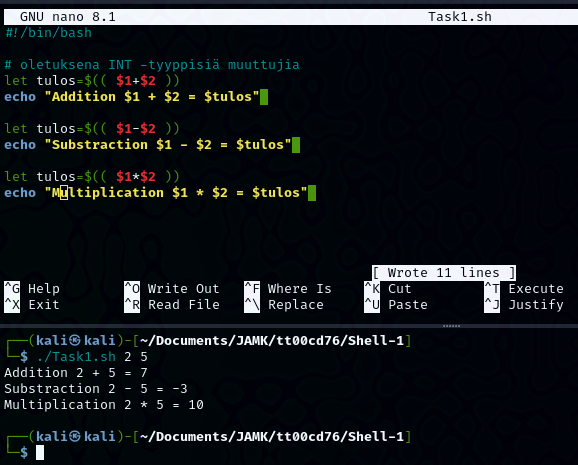
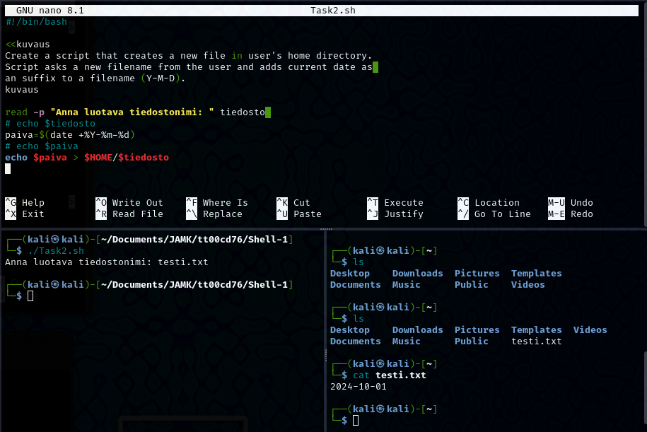
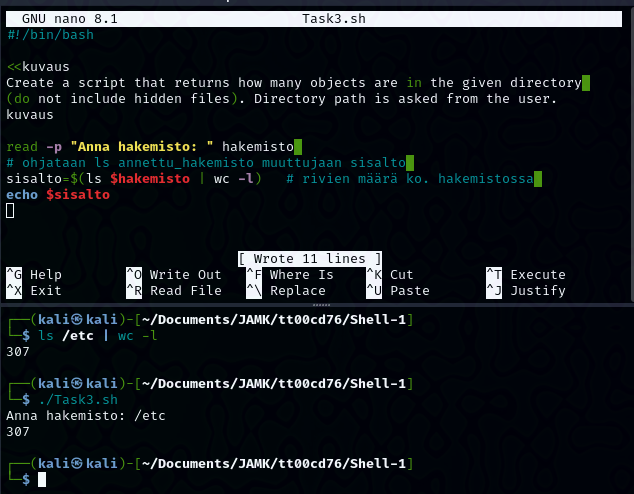
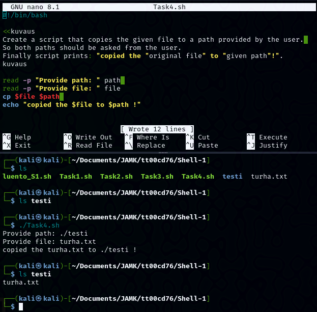
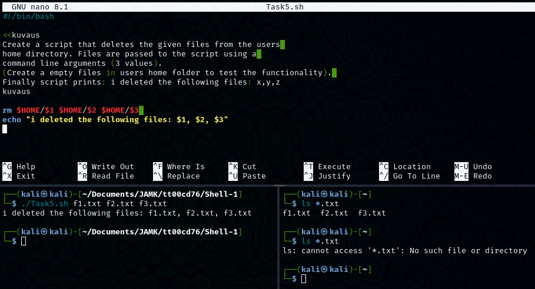

## Shell-1

### Task 1

Create a script that takes two **command line** arguments.
Script returns the following arithmetic solutions: addition, substraction, multiplication

 

```
#!/bin/bash

# oletuksena INT -tyyppisiä muuttujia
let tulos=$(( $1+$2 ))
echo "Addition $1 + $2 = $tulos" 

let tulos=$(( $1-$2 ))
echo "Substraction $1 - $2 = $tulos" 

let tulos=$(( $1*$2 ))
echo "Multiplication $1 * $2 = $tulos" 
```

### Task 2

Create a script that creates a new file in user's home directory.
Script asks a new filename from the user and adds current date as an suffix to a filename (Y-M-D).

 
```
#!/bin/bash
read -p "Anna luotava tiedostonimi: " tiedosto 
paiva=$(date +%Y-%m-%d)
echo $paiva > $HOME/$tiedosto

```

### Task 3

Create a script that returns how many objects are in the given directory (do not include hidden files). Directory path is asked from the user.
Hints:
***wc command might be useful.***

 
```
#!/bin/bash
read -p "Anna hakemisto: " hakemisto 
sisalto=$(ls $hakemisto | wc -l)
echo $sisalto 
```

### Task 4

Create a script that copies the given file to a path provided by the user. So both paths should be asked from the user.
Finally script prints: "copied the "original file" to "given path"!".

 

```
#!/bin/bash
read -p "Provide path: " path 
read -p "Provide file: " file 
cp $file $path 
echo "copied the $file to $path !" 
```

### Task 5

Create a script that deletes the given **files** from the users home directory. Files are passed to the script using a command line arguments (3 values).
(Create a empty files in users home folder to test the functionality). Finally script prints: i deleted the following files: x,y,z

 
```
#!/bin/bash

rm $HOME/$1 $HOME/$2 $HOME/$3 
echo "i deleted the following files: $1, $2, $3"

```
