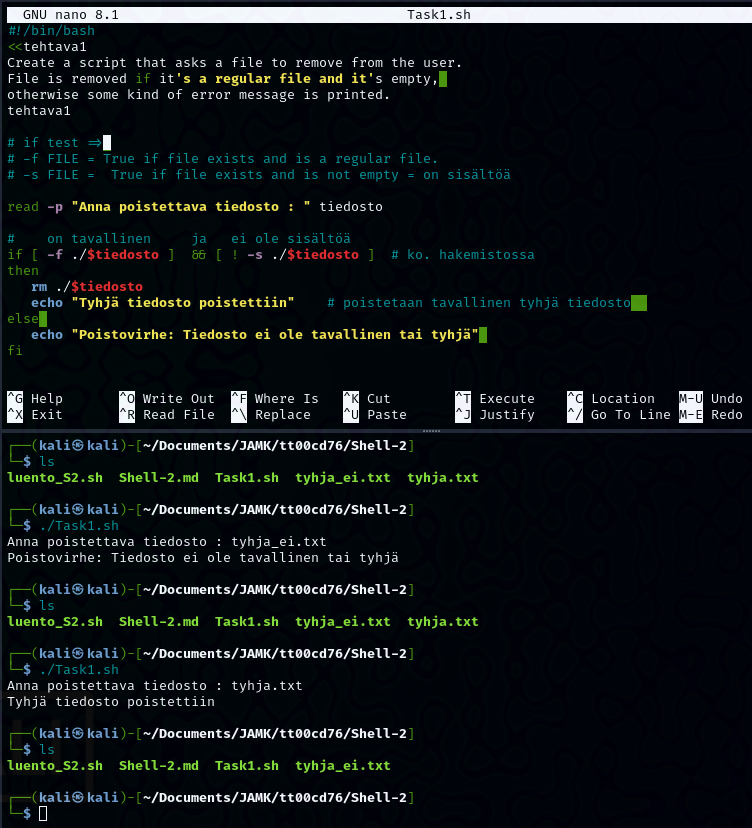
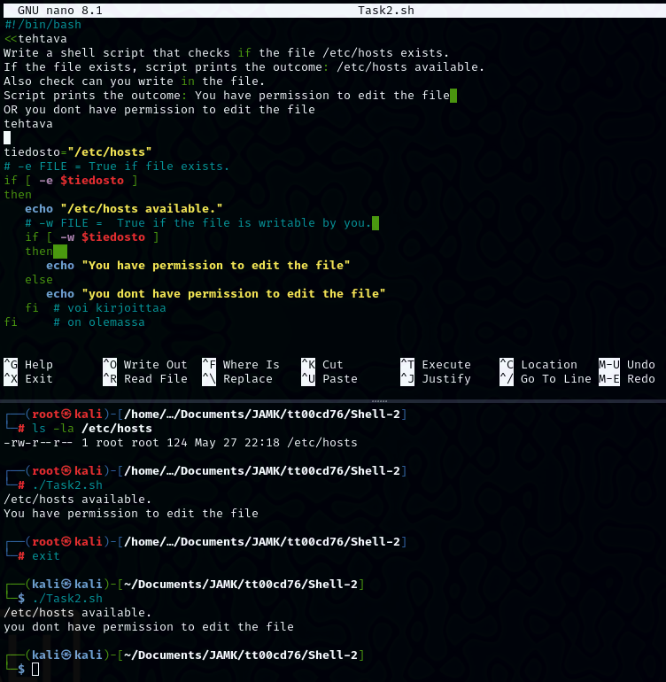
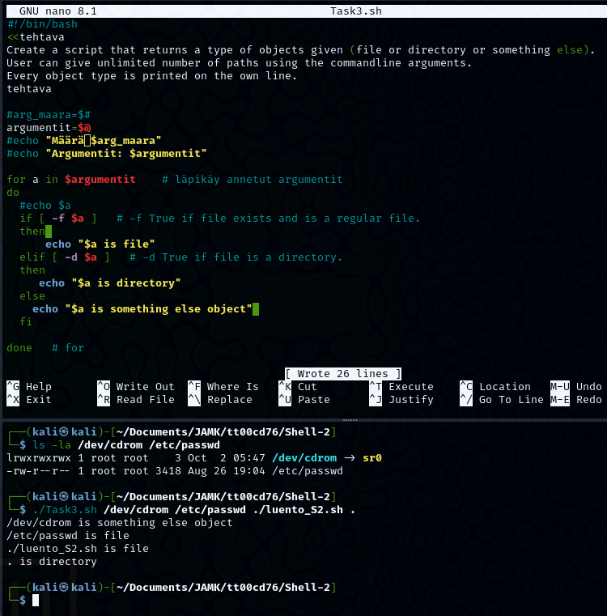
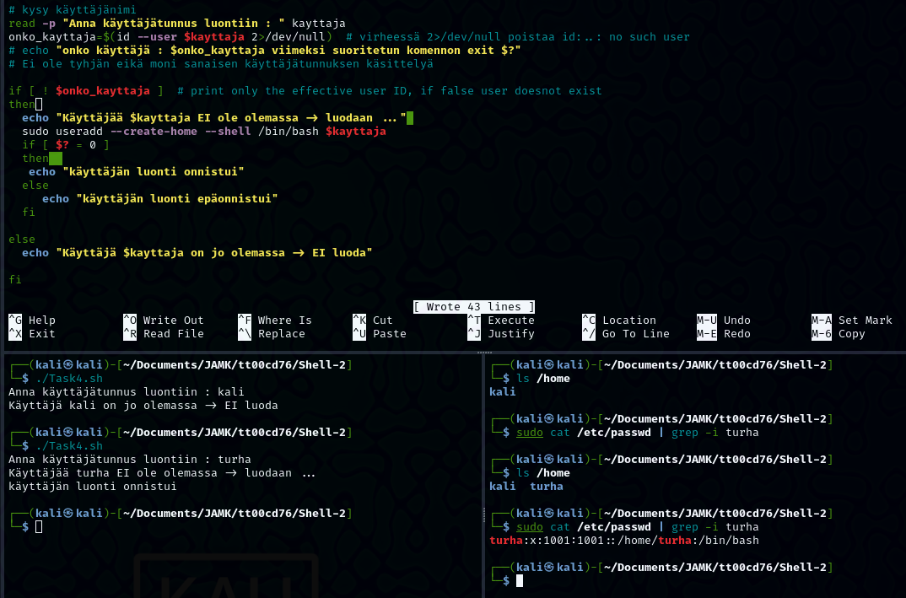
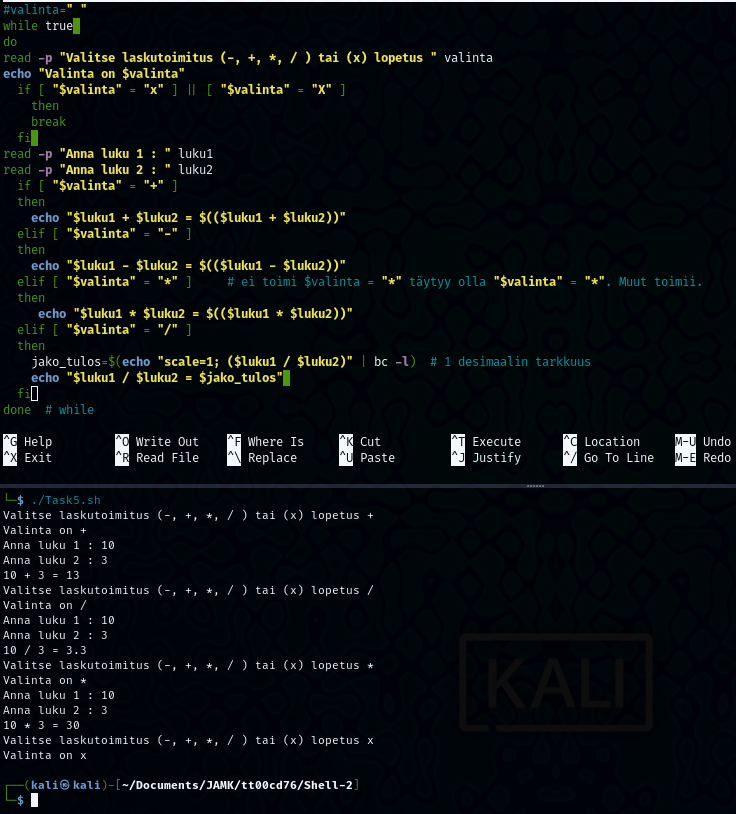

## Shell-2

### Task 1

Create a script that asks a file to remove from the user.
File is removed if it's a **regular file** and it's empty, otherwise some kind of error message is printed.

 

```
#!/bin/bash
read -p "Anna poistettava tiedosto : " tiedosto

#    on tavallinen     ja   ei ole sisältöä
if [ -f ./$tiedosto ]  && [ ! -s ./$tiedosto ]  # ko. hakemistossa
then
   rm ./$tiedosto
   echo "Tyhjä tiedosto poistettiin"    # poistetaan tavallinen tyhjä tiedosto  
else 
   echo "Poistovirhe: Tiedosto ei ole tavallinen tai tyhjä" 
fi
```

### Task 2

Write a shell script that checks if the file ***/etc/hosts*** exists.
If the file exists, script prints the outcome: /etc/hosts available.
Also check can you write in the file.
Script prints the outcome: You have permission to edit the file OR you dont have permission to edit the file

 
```
#!/bin/bash

tiedosto="/etc/hosts"
# -e FILE = True if file exists.
if [ -e $tiedosto ]
then
   echo "/etc/hosts available."
   # -w FILE =  True if the file is writable by you. 
   if [ -w $tiedosto ]
   then  
      echo "You have permission to edit the file"
   else
      echo "you dont have permission to edit the file"
   fi  # voi kirjoittaa
fi     # on olemassa

```

### Task 3

Create a script that returns a type of objects given (file or directory or something else).
User can give unlimited number of paths using the commandline arguments.
Every object type is printed on the own line.

 
```               
#!/bin/bash

argumentit=$@
for a in $argumentit    # läpikäy annetut argumentit
do
  if [ -f $a ]   # -f True if file exists and is a regular file.
  then 
      echo "$a is file"
  elif [ -d $a ]   # -d True if file is a directory.
  then
     echo "$a is directory"
  else
    echo "$a is something else object" 
  fi
done   # for
```

### Task 4

Create a script to automate user creation. **NOTE:** no password setup!
Script asks username from the user and before the user is created, script must check if the user with that name exists.
Use the following syntax in you conditional statement: if ***id -u USERNAME***. If the user doesn't exist, conditional statement returns false (actual id command returns "no such user" / error code 1).
New user must have home directory under the **/home/** directory and default shell as bash.
Hint: User creation needs sudo permissions, how to execute script with it?

 

```                                                   
#!/bin/bash
read -p "Anna käyttäjätunnus luontiin : " kayttaja
onko_kayttaja=$(id --user $kayttaja 2>/dev/null) # virheessä 2>/dev/null poistaa id:..: no such user
if [ ! $onko_kayttaja ]  # print only the effective user ID, if false user doesnot exist
then
  echo "Käyttäjää $kayttaja EI ole olemassa -> luodaan ..." 
  sudo useradd --create-home --shell /bin/bash $kayttaja
  if [ $? = 0 ]
  then  
   echo "käyttäjän luonti onnistui"
  else
     echo "käyttäjän luonti epäonnistui"
  fi

else
  echo "Käyttäjä $kayttaja on jo olemassa -> EI luoda"
fi
```

### Task 5

Create a script that mimics a simple calculator.
At first, script asks the operation from the user (**-, +, *, / **). After the user selects operation, two values are asked and the outcome is printed to the user.
Script execution stops when the user selects "exit" operation.

 

```
#!/bin/bash
#valinta=" "
while true 
do
read -p "Valitse laskutoimitus (-, +, *, / ) tai (x) lopetus " valinta
echo "Valinta on $valinta"
  if [ "$valinta" = "x" ] || [ "$valinta" = "X" ]
    then
    break
  fi 
read -p "Anna luku 1 : " luku1
read -p "Anna luku 2 : " luku2
  if [ "$valinta" = "+" ]
  then
    echo "$luku1 + $luku2 = $(($luku1 + $luku2))"
  elif [ "$valinta" = "-" ]
  then
    echo "$luku1 - $luku2 = $(($luku1 - $luku2))"
  elif [ "$valinta" = "*" ]     # ei toimi $valinta = "*" täytyy olla "$valinta" = "*". Muut toimii.
  then
     echo "$luku1 * $luku2 = $(($luku1 * $luku2))"
  elif [ "$valinta" = "/" ]
  then
    jako_tulos=$(echo "scale=1; ($luku1 / $luku2)" | bc -l)  # 1 desimaalin tarkkuus
    echo "$luku1 / $luku2 = $jako_tulos" 
  fi
done  # while

```
