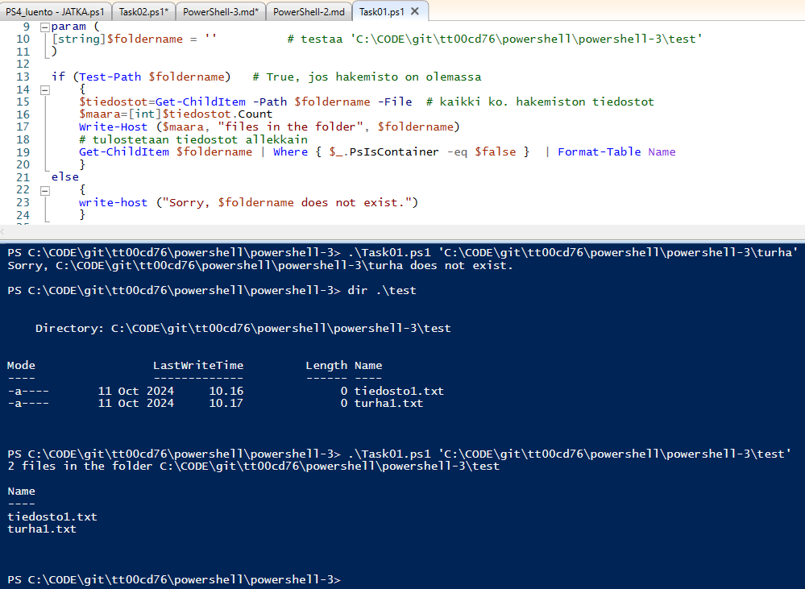
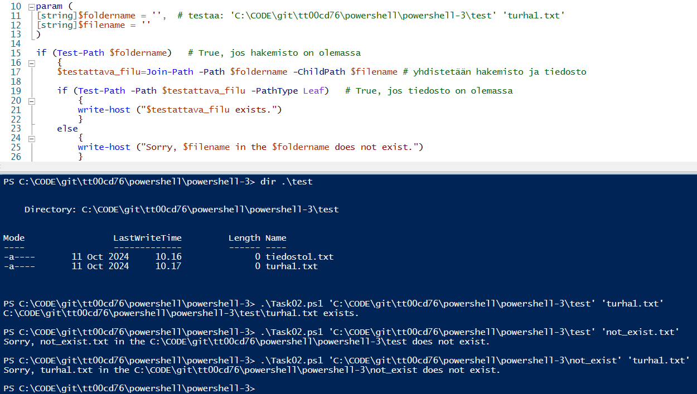
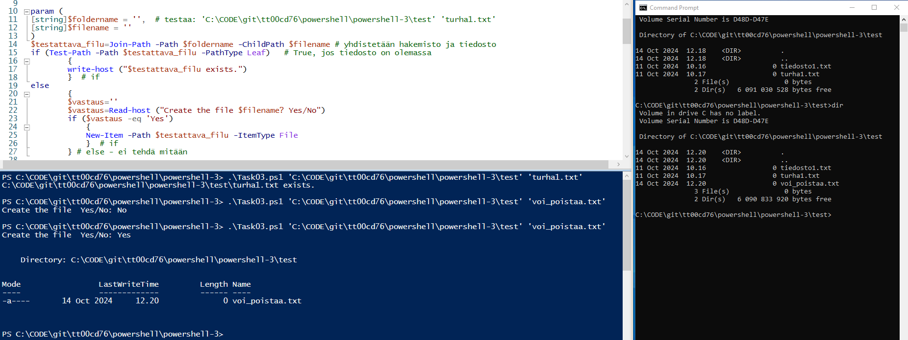
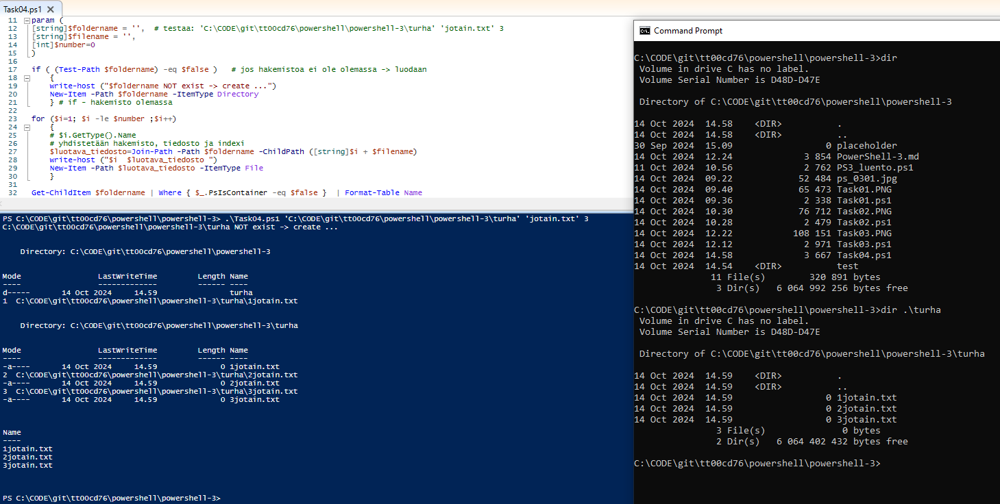
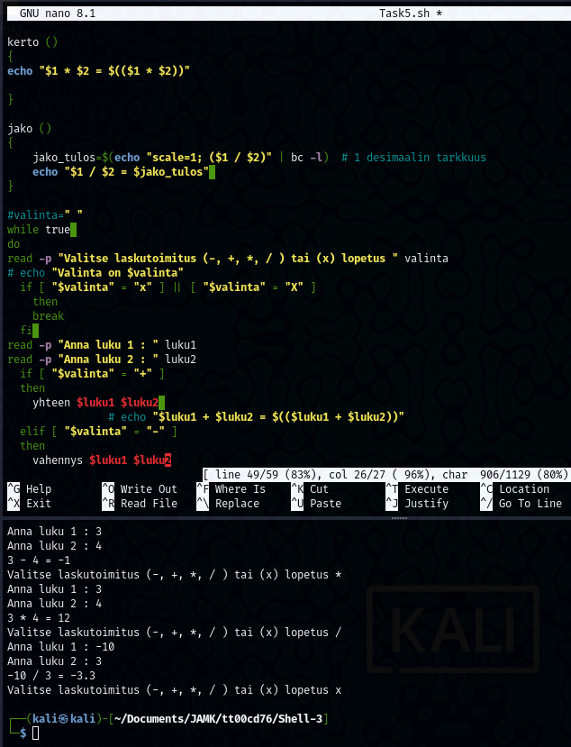

## Shell-3

### Task 1

Create a script that asks values from the user until user types exit. All the values are saved in array. Finally script prints out the whole array (line by line) using the following syntax: index: value.

 

```
#!/bin/bash
### Task 3/1
index=0
declare -a taulu

while true
read -p "Anna arvo tai exit poistuaksesi: " arvo
do
  if  [ $arvo = "exit" ]
  then
    break
  fi
taulu[$index]=$arvo
((index++))
done

index=0
for i in ${taulu[@]}
do
  echo "$index : $i" 
  ((index++))
done 
```

### Task 2

Create a script that prints a number of objects in the directory where you executed the script from.
Script must consist a function called count_objects. Function must have one local variable, that will hold the actual value, before it's printed to the user.
Hints:
Function has a print functionality. wc command might be useful.

 
```
#!/bin/bash

function count_objects() 
{
local objektit=$(ls -la | wc -l)
let objektit--       # total 36 -tekstirivi pois laskuista
echo "Objektien määrä ko. hakemistossa (total -rivi pois) : $objektit"
}
 
count_objects

```

### Task 3

**Modify Task 2.**
Create a script that prints a number of objects in a **given directory** to the user. The path is asked from the user.

 

```               
#!/bin/bash

function count_objects() 
{
# echo  "Funktiossa parametri : ${1}"
# HUOM ! käyttöoikeudet  

local objektit=$(ls -la ${1} | wc -l)
let objektit--       # total 36 -tekstirivi pois laskuista
echo "Objektien määrä ko. hakemistossa (total -rivi pois) : $objektit"
}

read -p "Anna hakemisto " hakemisto
count_objects $hakemisto

```

### Task 4

Modify **Task 3.**
User can give unlimited number of paths and given paths are saved in the array.
Function takes an array as an argument.
Hints:
read commands options might be useful or some kind of loop.

 

```  
#!/bin/bash

function count_objects() 
{
tmp=$@
# HUOM ! käyttöoikeudet  
# läpikäydään koko taulukon hakemistot
for x in ${tmp[@]}
do
  objektit=$(ls -la $x |  wc -l)
  let objektit--       # total 36 -tekstirivi pois laskuista
  echo "Objektien määrä hakemistossa (total -rivi pois) $x on $objektit"
done
}

i=0
declare -a hakemisto_taulu
while true
do
read -p "Anna hakemisto tai x lopettaaksesi ja tulostaaksesi : " hakemisto
   if [ $hakemisto = "x" ]
    then  # lopetus ja tulostetaan annetut objektit 
    	count_objects ${hakemisto_taulu[@]} 
    break
   else   # lisätään tauluun
     hakemisto_taulu[$i]+=$hakemisto
     let i++
   fi
done                                                 
```

### Task 5

Modify **Exercise set 2, Task 5** (Create a script that mimics a simple calculator).
Change the logic that all operations are calculated by using functions.

 

```
#!/bin/bash

yhteen ()
{
echo "$1 + $2 = $(($1 + $2))"
}

vahennys ()
{
echo "$1 - $2 = $(($1 - $2))"
}

kerto ()
{
echo "$1 * $2 = $(($1 * $2))"

}

jako ()
{
    jako_tulos=$(echo "scale=1; ($1 / $2)" | bc -l)  # 1 desimaalin tarkkuus
    echo "$1 / $2 = $jako_tulos" 
}

#valinta=" "
while true 
do
read -p "Valitse laskutoimitus (-, +, *, / ) tai (x) lopetus " valinta
# echo "Valinta on $valinta"
  if [ "$valinta" = "x" ] || [ "$valinta" = "X" ]
    then
    break
  fi 
read -p "Anna luku 1 : " luku1
read -p "Anna luku 2 : " luku2
  if [ "$valinta" = "+" ]
  then
    yhteen $luku1 $luku2 
  elif [ "$valinta" = "-" ]
  then
    vahennys $luku1 $luku2
  elif [ "$valinta" = "*" ]     
         # ei toimi $valinta = "*" täytyy olla "$valinta" = "*". Muut toimii.
  then
     kerto $luku1 $luku2
  elif [ "$valinta" = "/" ]
  then
    jako $luku1 $luku2 
  fi
done  # while
```
