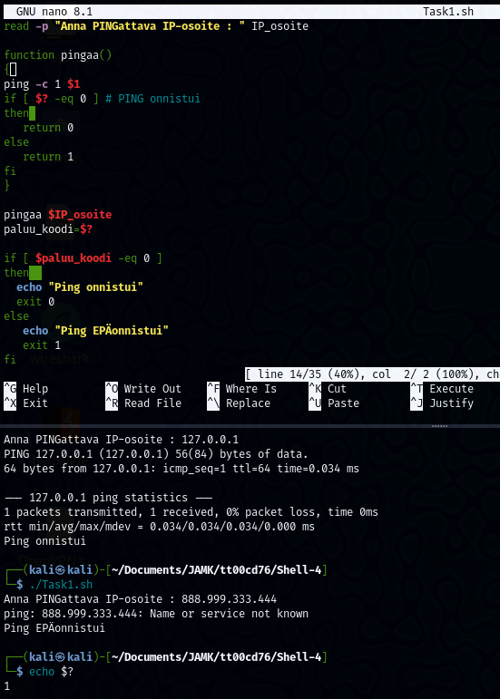
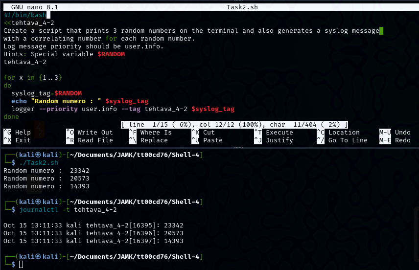
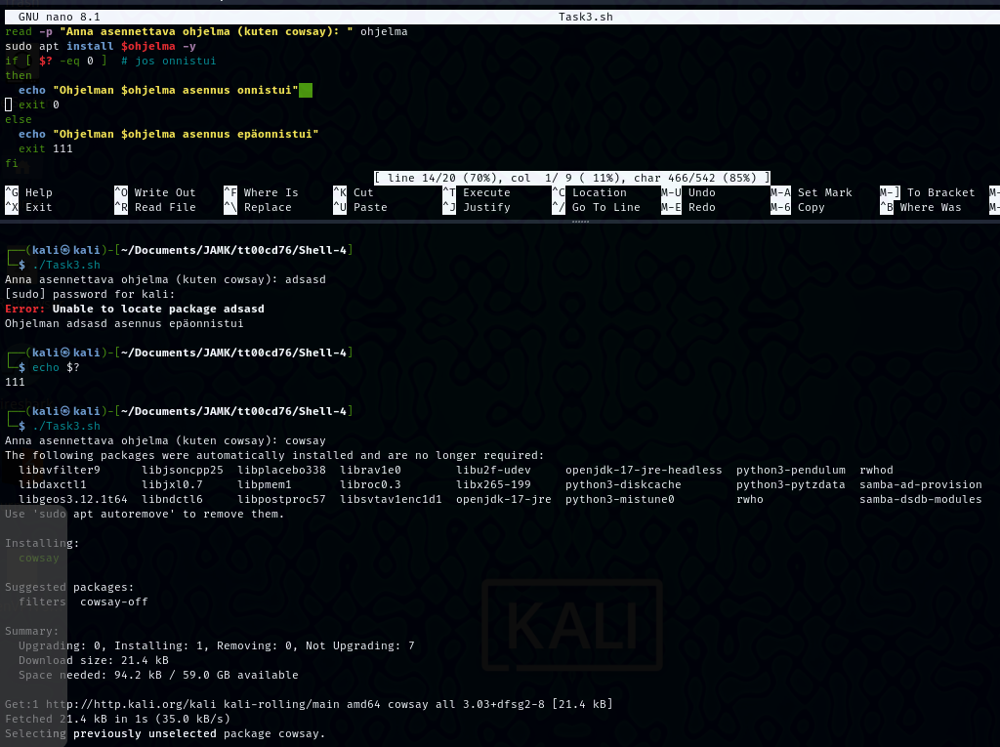
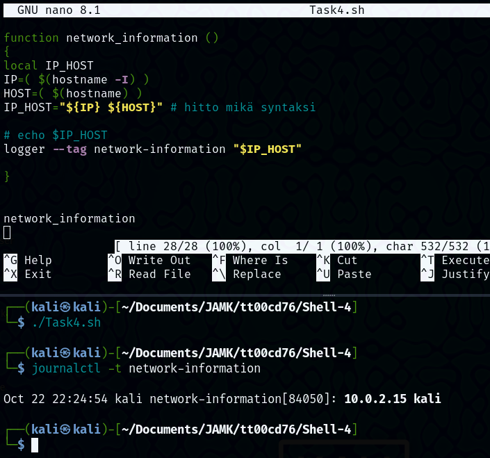
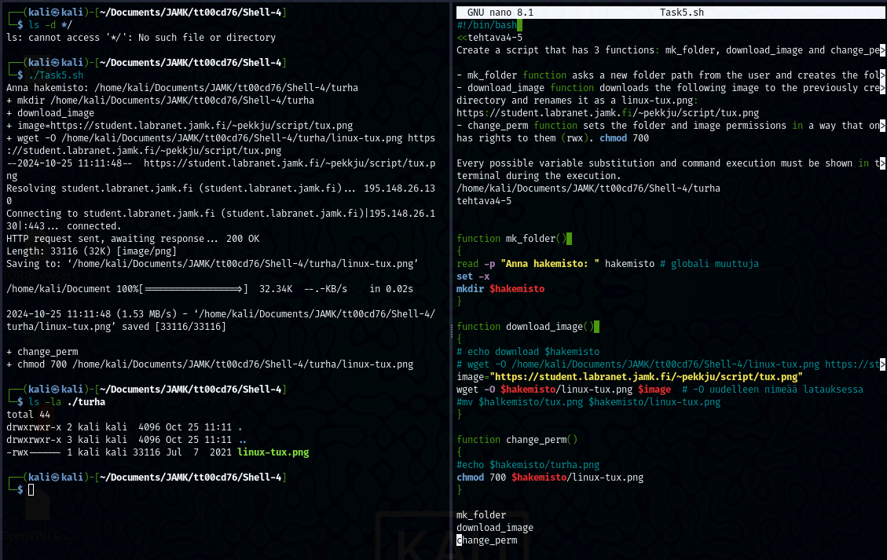

## PowerShell-4

### Task01

Create a script that asks URL from the user and a function that tries to ping it with a 1 package.
If ping is successfull, return a exit code 0.
If not, return a exit code 1.
Based on the exit code that the function returned, print outcome to user.

 

```
#!/bin/bash

read -p "Anna PINGattava IP-osoite : " IP_osoite

function pingaa()
{
ping -c 1 $1
if [ $? -eq 0 ] # PING onnistui
then 
   return 0
else
   return 1
fi
}

pingaa $IP_osoite
paluu_koodi=$?

if [ $paluu_koodi -eq 0 ]
then  
  echo "Ping onnistui"
  exit 0
else
   echo "Ping EPÄonnistui"
   exit 1
fi
```

---
### Task02

Create a script that prints 3 random numbers on the terminal and also generates a syslog message with a correlating number for each random number.
Log message priority should be user.info.
*Hints:* Special variable $RANDOM

 

```
#!/bin/bash

for x in {1..3}
do
  syslog_tag=$RANDOM
  echo "Random numero : " $syslog_tag
  logger --priority user.info --tag tehtava_4-2 $syslog_tag
done

```

---
### Task03

Create a script that installs the program using apt, based on the user input. (cowsay etc.)
If the installation is successfull, tell that to the user and exit normally.
If not, inform user and exit with a code 111.
*Hints:* sudo permissions and apt options

 

```
#!/bin/bash
read -p "Anna asennettava ohjelma (kuten cowsay): " ohjelma
sudo apt install $ohjelma -y
if [ $? -eq 0 ]  # jos onnistui
then
  echo "Ohjelman $ohjelma asennus onnistui"  
  exit 0
else
  echo "Ohjelman $ohjelma asennus epäonnistui"
  exit 111
fi

```

---
### Task04

Create a script that has a function called network_information that shows the following information:

- ip address: 
- hostname: 

Log the messages in the syslog with a custom tag "network-information".
*Hints:* Utilize arrays and ip or hostname commands with options

 

```
#!/bin/bash
function network_information ()
{
local IP_HOST
IP=( $(hostname -I) )
HOST=( $(hostname) )
IP_HOST="${IP} ${HOST}" # hitto mikä syntaksi

# echo $IP_HOST
logger --tag network-information "$IP_HOST"
}

network_information
```

---
### Task05

Create a script that has 3 functions: mk_folder, download_image and change_perm.

mk_folder function asks a new folder path from the user and creates the folder.
download_image function downloads the following image to the previously created directory and renames it as a linux-tux.png: image

change_perm function sets the folder and image permissions in a way that only owner has rights to them (rwx).

Every possible variable substitution and command execution must be shown in the terminal during the execution.

 

```¨
#!/bin/bash 

function mk_folder() 
{
read -p "Anna hakemisto: " hakemisto   # globali muuttuja
set -x
mkdir $hakemisto
}

function download_image() 
{
image="https://student.labranet.jamk.fi/~pekkju/script/tux.png"
wget -O $hakemisto/linux-tux.png $image  # -O uudelleen nimeää latauksessa
}

function change_perm()
{
chmod 700 $hakemisto/linux-tux.png
}

mk_folder
download_image
change_perm

```
