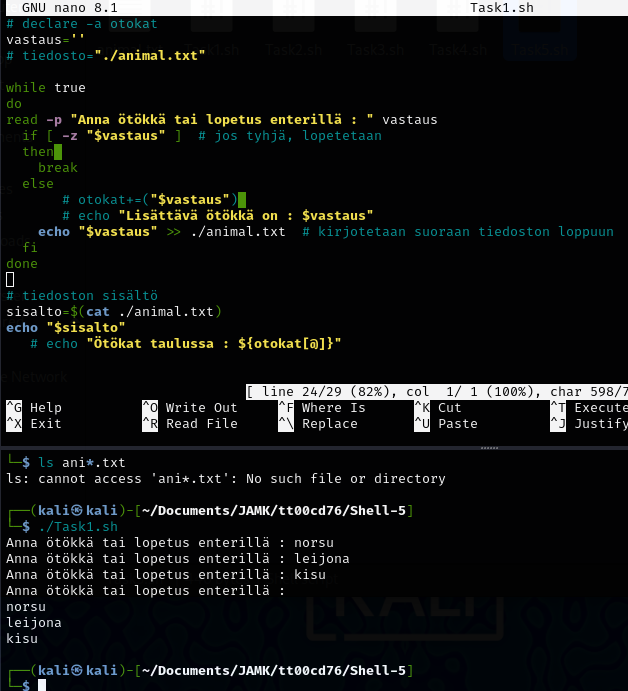
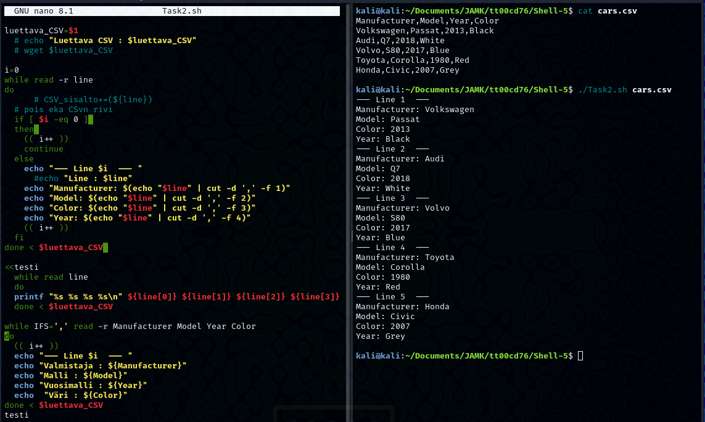
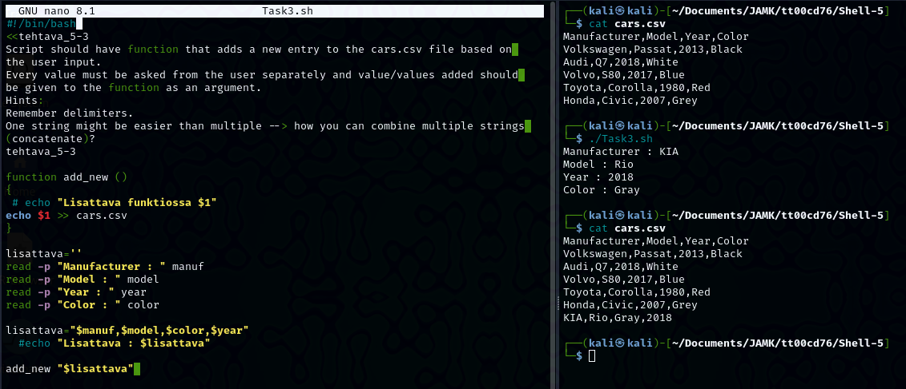

## PowerShell-5

### Task01
Create a script that asks values from the user until user decides to end the script.
Given values are added to the end of file called animal.txt
Finally script prints every value from the file.

 

```
#!/bin/bash

```

---
### Task02
Create a script that reads cars.csv file.
(https://gitlab.labranet.jamk.fi/ttc2060/shell-tasks/-/blob/master/Shell-5/cars.csv)
File that is read must be given at the script startup as a command line argument.
Script reads information from the file and prints the values to the user.
Output format:
--- Line 1 ---
Manufacturer: X
Model: X
Color: X
Year: X
--- Line 2 ---
Manufacturer: Y
Model: Y
Color: Y
Year: Y

 

```
#!/bin/bash


```

---
### Task03
Script should have function that adds a new entry to the cars.csv file based on the user input.
Every value must be asked from the user separately and value/values added should be given to the function as an argument.
Hints:
Remember delimiters.
One string might be easier than multiple --> how you can combine multiple strings (concatenate)?

 

```
#!/bin/bash


```

---
### Task04

Create a script that have a function that changes services listening ports (80 x2) and default page (index.html) defined in example.conf.
New values are given as command line arguments during the script startup. Only one port is given and it's used for both fields.
NOTE: Script should overwrite the default values, not every possible value in that spot (think that those are values after the apt install command)
Hints:
Sed command needs some option to write the changes.

 

```
#!/bin/bash


```

---
### Task05
Create a script that reads superhero.json file.
(https://gitlab.labranet.jamk.fi/ttc2060/shell-tasks/-/blob/master/Shell-5/superhero.json)
Script prints hero names to the user who selects which heroes powers or secret identity he/she wants to see.
Script prints the desired values to the user.
Script will continue asking what to do until user gives some string to exit to script (exit perhaps?).
Hints:
any iterations structure
jq command

 

```¨
#!/bin/bash 

```
