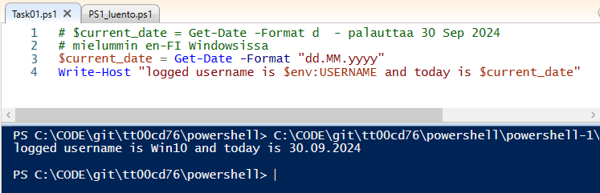
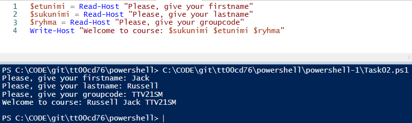
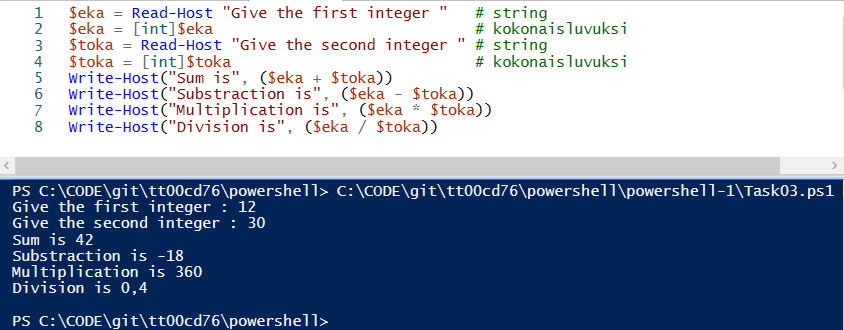
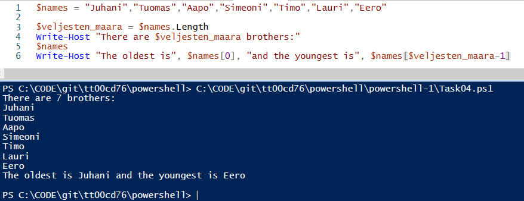
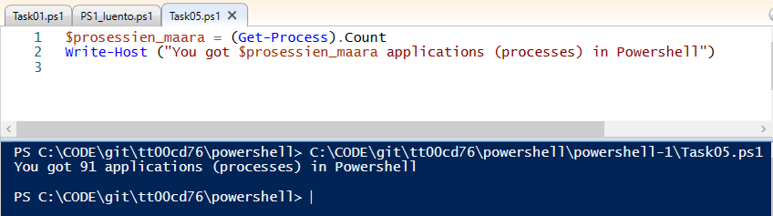

## PowerShell-1

### Task01
Create a script that writes current logged username and current date to console.

 
```
# $current_date = Get-Date -Format d  - palauttaa 30 Sep 2024
# mielummin en-FI Windowsissa
$current_date = Get-Date -Format "dd.MM.yyyy"
Write-Host "logged username is $env:USERNAME and today is $current_date"
```

### Task02
Ask from a user his/her firstname, lastname and groupcode. Save them to variables. After that show the following info in console.

 
```
$etunimi = Read-Host "Please, give your firstname"
$sukunimi = Read-Host "Please, give your lastname"
$ryhma = Read-Host "Please, give your groupcode"
Write-Host "Welcome to course: $sukunimi $etunimi $ryhma"
```

### Task03
Ask two integers from a user, and return addition, subtraction, multiplication and division of numbers.

 
```
$eka = Read-Host "Give the first integer "   # string
$eka = [int]$eka                             # kokonaisluvuksi
$toka = Read-Host "Give the second integer " # string
$toka = [int]$toka                           # kokonaisluvuksi
Write-Host("Sum is", ($eka + $toka))
Write-Host("Substraction is", ($eka - $toka))
Write-Host("Multiplication is", ($eka * $toka))
Write-Host("Division is", ($eka / $toka))
```

### Task04
Create an array named $names, that includes seven (7) names. You can select the names, they can be your friends or comic characters. Create a script that show how many items is in the array, show the items and also the first and last name of the array.

 
```
$names = "Juhani","Tuomas","Aapo","Simeoni","Timo","Lauri","Eero"

$veljesten_maara = $names.Length
Write-Host "There are $veljesten_maara brothers:"
$names
Write-Host "The oldest is", $names[0], "and the youngest is", $names[$veljesten_maara-1]
```

### Task05
PowerShell includes many kind of commands: alias, cmdlets, function and application. Create a script that counts how many application PowerShell returns.

 
```
$prosessien_maara = (Get-Process).Count 
Write-Host ("You got $prosessien_maara applications (processes) in Powershell")
```
