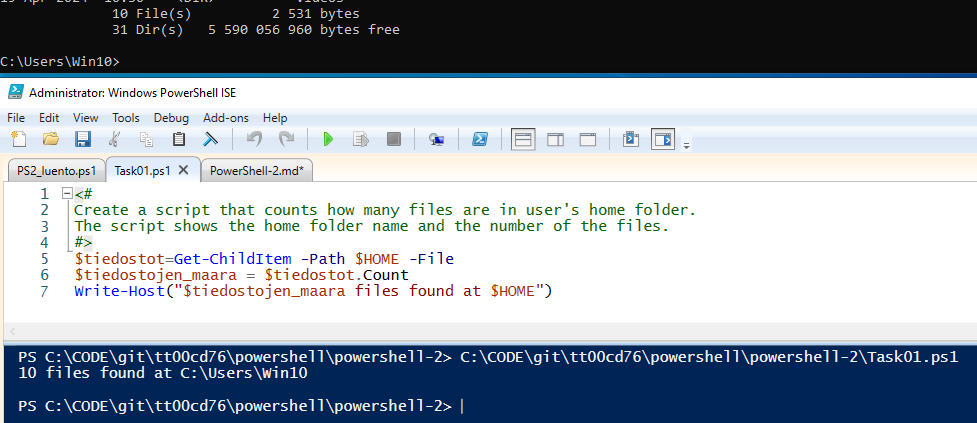
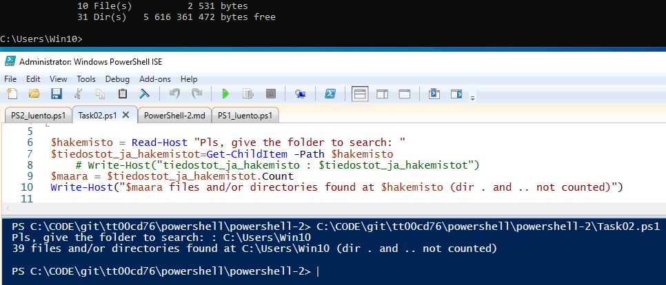
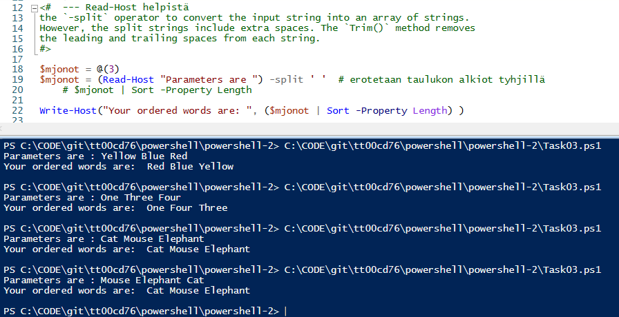
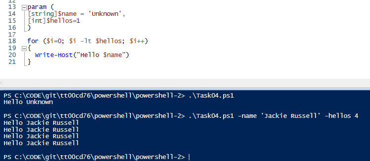
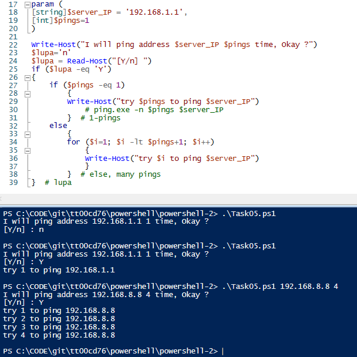

## PowerShell-2

### Task01

Create a script that counts how many files are in user's home folder. 
The script shows the home folder name and the number of the files.

 

```
$tiedostot=Get-ChildItem -Path $HOME -File
$tiedostojen_maara = $tiedostot.Count
Write-Host("$tiedostojen_maara files found at $HOME")

```

### Task02

Create a script that counts how many files and folders are in given folder. 
The script shows the name of the folder and the number of the files.

 
```
$hakemisto = Read-Host "Pls, give the folder to search: "
$tiedostot_ja_hakemistot=Get-ChildItem -Path $hakemisto
$maara = $tiedostot_ja_hakemistot.Count
Write-Host("$maara files and/or directories found at $hakemisto (dir . and .. not counted)")
```

### Task03

Create a script that takes three parameters, the type of the parameters is string. The script order the given strings by string length. 
Test your script at least with four different test runs, like in the picture.

**Testing**
*Yellow Blue Red -> Red Blue Yellow* 
*One Three Four  -> O-F-T*
*Cat Mouse Elephant -> C-M-E*
*Mouse Elephant Cat -> C-M-E*

 

```
<#  --- Read-Host helpist
the `-split` operator to convert the input string into an array of strings. 
However, the split strings include extra spaces. The `Trim()` method removes 
the leading and trailing spaces from each string.
#>

$mjonot = @(3)
$mjonot = (Read-Host "Parameters are ") -split ' '  # erotetaan taulukon alkiot tyhjill�
    # $mjonot | Sort -Property Length

Write-Host("Your ordered words are: ", ($mjonot | Sort -Property Length) )
```

### Task04

Create a script that takes two named parameters. The first parameter is the name of a user, second how many times the script greets the user. 
Give default values for the parameters, so if the script is run without arguments, it will say **Hello unknown** only once.

**Testing**
*Task04.ps1 -name 'Jackie Russell' -hellos 4*

 
```
param (
[string]$name = 'Unknown',
[int]$hellos=1
)

for ($i=0; $i -lt $hellos; $i++)
{
  Write-Host("Hello $name")
}
```

### Task05

Create a script that simulates pinging a remote server. 
It takes two named parameters. The first parameter is the 
IP-address of a server, second how many times the ping is tried. 
The script also ask the permission to make ping with. 
Pings are made only if a user says Yes. Give default values for the parameters, 
so if the script will be run without the arguments, it will try to ping **192.168.1.1** only once. 
Because **ping** is blocked in the labranet, we simulate only pinging.

**Testing**
*.\Task05.ps1*
*.\Task05.ps1 192.168.8.8 4*

 

```
param (
[string]$server_IP = '192.168.1.1',
[int]$pings=1
)

Write-Host("I will ping address $server_IP $pings time, Okay ?")
$lupa='n'
$lupa = Read-Host("[Y/n] ")
if ($lupa -eq 'Y')
{
 if( $pings -eq 1)
    {
    Write-Host("try $pings to ping $server_IP")
       # ping.exe -n $pings $server_IP
    }  # 1-pings
    else 
    {
    for ($i=1; $i -lt $pings+1; $i++)
        {
        Write-Host("try $i to ping $server_IP")
        }
    }  # else, many pings
}  # lupa
```
