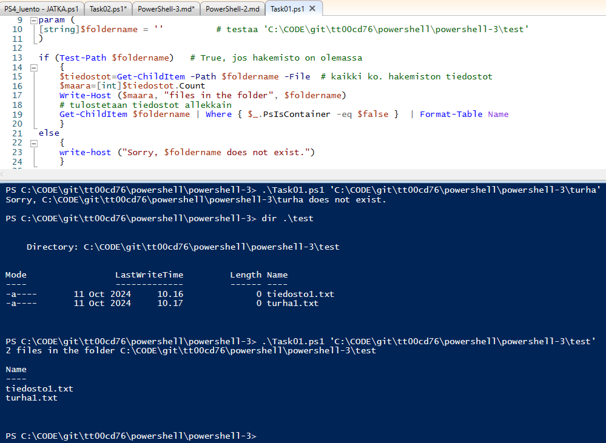
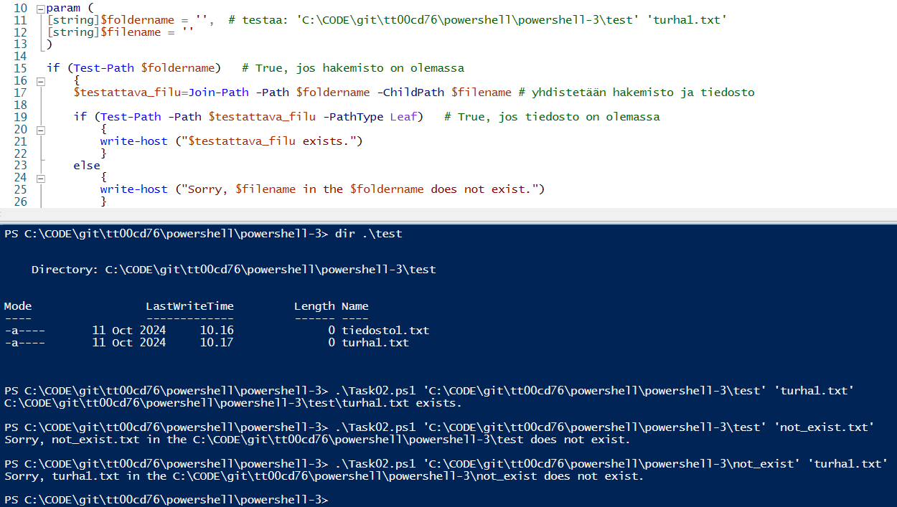
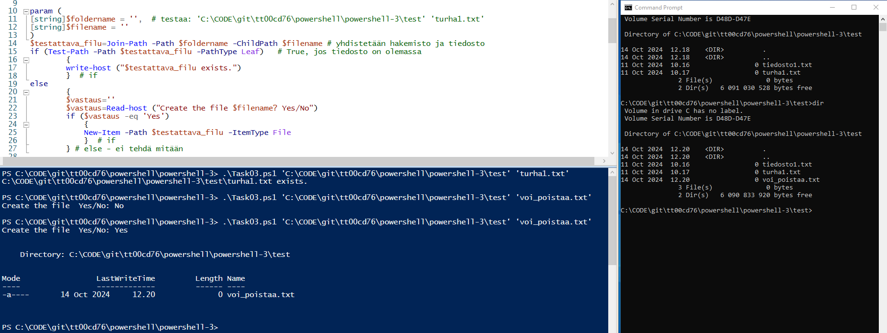
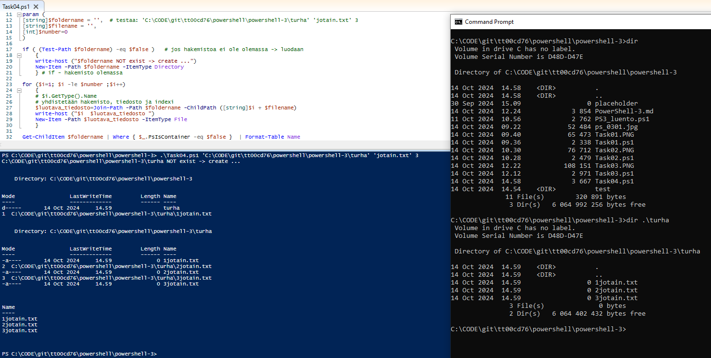

## PowerShell-3

### Task01

Create a script that takes one parameter: **foldername**. Check if the given folder exist. 
If the folder exist: show how many files are in the folder and then list the files of the folder. 
If the folder does not exist, the script will show a message: "Sorry, {foldername} does not exist.".

 

```
param (
[string]$foldername = ''          # testaa 'C:\CODE\git\tt00cd76\powershell\powershell-3\test'
)

if (Test-Path $foldername)   # True, jos hakemisto on olemassa
    {
    $tiedostot=Get-ChildItem -Path $foldername -File  # kaikki ko. hakemiston tiedostot
    $maara=[int]$tiedostot.Count
    Write-Host ($maara, "files in the folder", $foldername)
    # tulostetaan tiedostot allekkain
    Get-ChildItem $foldername | Where { $_.PsIsContainer -eq $false }  | Format-Table Name
    }
else
    {
    write-host ("Sorry, $foldername does not exist.")
    }

```

### Task02

Create a script that takes two parameters: **foldername** and **filename**. Check first if the given folder exist. If the folder exists, check if the file exists in the folder. If true, show a proper message. If it does not exist, show a message: "Sorry, {filename} in the {foldername} does not exist.".

 

```
param (
[string]$foldername = '',  # testaa: 'C:\CODE\git\tt00cd76\powershell\powershell-3\test' 'turha1.txt'
[string]$filename = ''  
)

if (Test-Path $foldername)   # True, jos hakemisto on olemassa
    {
    $testattava_filu=Join-Path -Path $foldername -ChildPath $filename # yhdistet‰‰n hakemisto ja tiedosto
        
    if (Test-Path -Path $testattava_filu -PathType Leaf)   # True, jos tiedosto on olemassa
        {
        write-host ("$testattava_filu exists.")
        }
    else
        {
        write-host ("Sorry, $filename in the $foldername does not exist.")
        }
    }
else
    {
    write-host ("Sorry, $filename in the $foldername does not exist.")
    }

```

### Task03

Create a script that takes two parameters: **foldername** and **filename**. Check first if the given file is in the given folder. If the file exists, show a proper message. If it does not exist, ask from a user "Create the file {filename}? Yes/No". If the user returns "Yes", create the file to the folder.

 

```
param (
[string]$foldername = '',  # testaa: 'C:\CODE\git\tt00cd76\powershell\powershell-3\test' 'turha1.txt'
[string]$filename = ''  
)
$testattava_filu=Join-Path -Path $foldername -ChildPath $filename # yhdistet‰‰n hakemisto ja tiedosto
if (Test-Path -Path $testattava_filu -PathType Leaf)   # True, jos tiedosto on olemassa
        {
        write-host ("$testattava_filu exists.")
        }  # if
else
        {
        $vastaus=''
        $vastaus=Read-host ("Create the file $filename? Yes/No")
        if ($vastaus -eq 'Yes')
            {
            New-Item -Path $testattava_filu -ItemType File
            }  # if
        } # else - ei tehd‰ mit‰‰n

```

### Task04

Create a script that takes three parameters: **foldername**, **filename** and **number**. Check first if the given folder, exists. If not, create the folder. After that create as many new files as the number argument says to the folder. Finally return a report how many files has been created, and list the names of the files.

 

```
param (
[string]$foldername = '',  # testaa: 'C:\CODE\git\tt00cd76\powershell\powershell-3\turha' 'jotain.txt' 3
[string]$filename = '',
[int]$number=0 
)

if ( (Test-Path $foldername) -eq $false )   # jos hakemistoa ei ole olemassa -> luodaan
    {
    write-host ("$foldername NOT exist -> create ...")
    New-Item -Path $foldername -ItemType Directory
    } # if - hakemisto olemassa

for ($i=1; $i -le $number ;$i++)
    {
    # $i.GetType().Name
    # yhdistet‰‰n hakemisto, tiedosto ja indexi
    $luotava_tiedosto=Join-Path -Path $foldername -ChildPath ([string]$i + $filename)
    write-host ("$i  $luotava_tiedosto ")
    New-Item -Path $luotava_tiedosto -ItemType File
    }

Get-ChildItem $foldername | Where { $_.PsIsContainer -eq $false }  | Format-Table Name

```

### Task05

Create a script that takes two parameters: **foldername** and **newname**. 
Check first if the given folder, exists. If not, show a proper message and quit the script. 
If the folder exist, count files in the folder, and ask from a user: 
"All {number} files will be renamed with name {newname}. Yes/No". 
If the user returns "Yes", rename all files in the folder.

 

```

```
