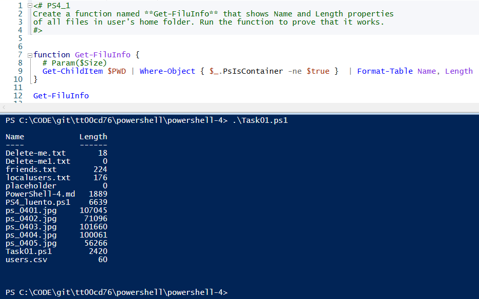
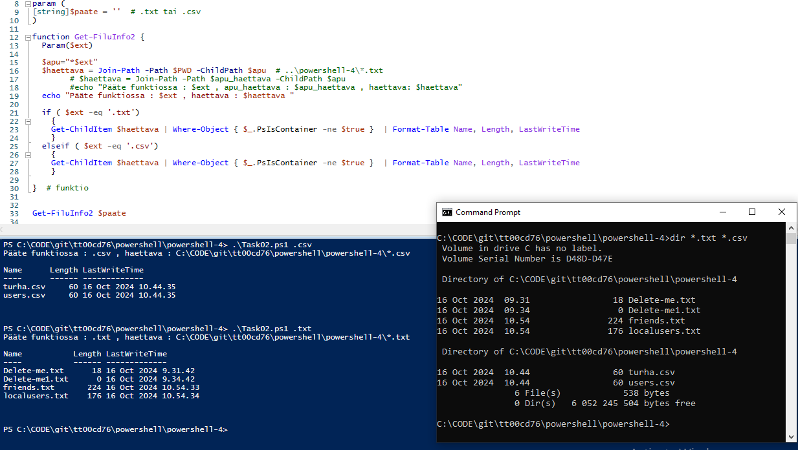
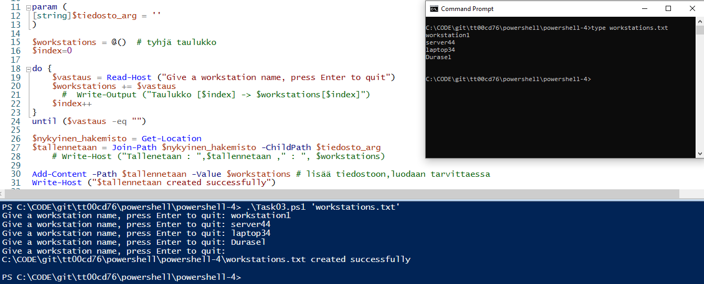
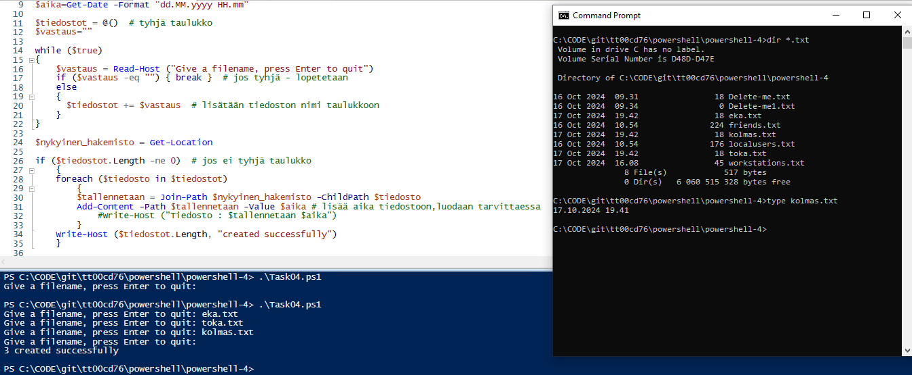
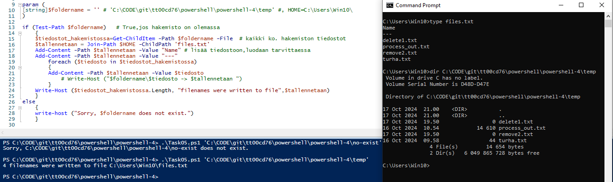

## PowerShell-4

### Task01

Create a function named **Get-FiluInfo** that shows Name and Length properties 
of all files in user's home folder. Run the function to prove that it works.

 

```
function Get-FiluInfo {
  Get-ChildItem $PWD | Where-Object { $_.PsIsContainer -ne $true }  | Format-Table Name, Length
}

Get-FiluInfo
```

---
### Task02

Create a function named **Get-FiluInfo2** that shows Name, Length, LastWriteTime 
properties of files with given extension in user's home folder. 
The extension is like .txt or .csv, and it has been given as a parameter. 
Run the function to prove that it works.

 

```
param (
[string]$paate = ''  # .txt tai .csv
)

function Get-FiluInfo2 {
  Param($ext)

  $apu="*$ext" 
  $haettava = Join-Path -Path $PWD -ChildPath $apu  # ..\powershell-4\*.txt

  if ( $ext -eq '.txt')
    {
    Get-ChildItem $haettava | Where-Object { $_.PsIsContainer -ne $true }  | Format-Table Name, Length, LastWriteTime
    }
  elseif ( $ext -eq '.csv')
    {
    Get-ChildItem $haettava | Where-Object { $_.PsIsContainer -ne $true }  | Format-Table Name, Length, LastWriteTime
    }

}  # funktio


Get-FiluInfo2 $paate
```
---
### Task03

Create a script that ask workstation names from an user. 
The names are asked until the user gives empty input. 
After that, the script writes all names to a file in user's home folder. 
The file name is given with the parameter: **filename**. 
Finally show a proper message that the file was created succesfully. 
Please, read about manipulating arrays
(https://docs.microsoft.com/en-us/powershell/module/microsoft.powershell.core/about/about_arrays?view=powershell-7.1).

 

```
param (
[string]$tiedosto_arg = ''
)

$workstations = @()  # tyhj‰ taulukko

do {
    $vastaus = Read-Host ("Give a workstation name, press Enter to quit") 
    $workstations += $vastaus
}
until ($vastaus -eq "")

$nykyinen_hakemisto = Get-Location 
$tallennetaan = Join-Path $nykyinen_hakemisto -ChildPath $tiedosto_arg

Add-Content -Path $tallennetaan -Value $workstations # lis‰‰ tiedostoon,luodaan tarvittaessa
Write-Host ("$tallennetaan created successfully")

```

---
### Task04

Create a script that ask file names from an user. The names are asked until 
the user gives empty input. 
After that, the script creates the files with given names to user's home folder. 
The script writes the current date and time to the files in the following format **30.9.2021 12.30**. 
Finally show a message that how many files were created succesfully.

 

```
$aika=Get-Date -Format "dd.MM.yyyy HH.mm"
$tiedostot = @()  # tyhj‰ taulukko
$vastaus=""

while ($true)
{
    $vastaus = Read-Host ("Give a filename, press Enter to quit") 
    if ($vastaus -eq "") { break }  # jos tyhj‰ - lopetetaan
    else
    {
      $tiedostot += $vastaus  # lis‰t‰‰n tiedoston nimi taulukkoon
    }
}

$nykyinen_hakemisto = Get-Location 

if ($tiedostot.Length -ne 0)  # jos ei tyhj‰ taulukko
    {
    foreach ($tiedosto in $tiedostot)
        {
        $tallennetaan = Join-Path $nykyinen_hakemisto -ChildPath $tiedosto
        Add-Content -Path $tallennetaan -Value $aika # lis‰‰ aika tiedostoon,luodaan tarvittaessa
        }
    Write-Host ($tiedostot.Length, "created successfully")
    }

```

### Task05

Create a script that takes one parameter: **foldername**. First check that the given folder exist, 
then write all names of files in the folder to a text file named files.txt. 
Create the file to user's home folder. 
If the folder does not exist, the script will show a message: "Sorry, {foldername} does not exist."

 

```
param (
[string]$foldername = '' # 'C:\CODE\git\tt00cd76\powershell\powershell-4\temp' #, HOME=C:\Users\Win10\
)

if (Test-Path $foldername)   # True,jos hakemisto on olemassa
    {
    $tiedostot_hakemistossa=Get-ChildItem -Path $foldername -File  # kaikki ko. hakemiston tiedostot
    $tallennetaan = Join-Path $HOME -ChildPath 'files.txt'
    Add-Content -Path $tallennetaan -Value "Name" # lis‰‰ tiedostoon,luodaan tarvittaessa
    Add-Content -Path $tallennetaan -Value "---" 
        foreach ($tiedosto in $tiedostot_hakemistossa)
        {
        Add-Content -Path $tallennetaan -Value $tiedosto 
        }
    Write-Host ($tiedostot_hakemistossa.Length, "filenames were written to file",$tallennetaan)
    }
else
    {
    write-host ("Sorry, $foldername does not exist.")
    }

```
