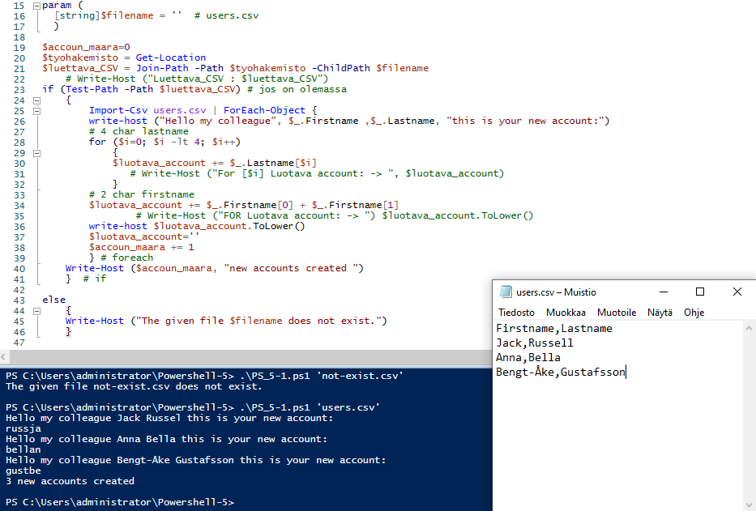
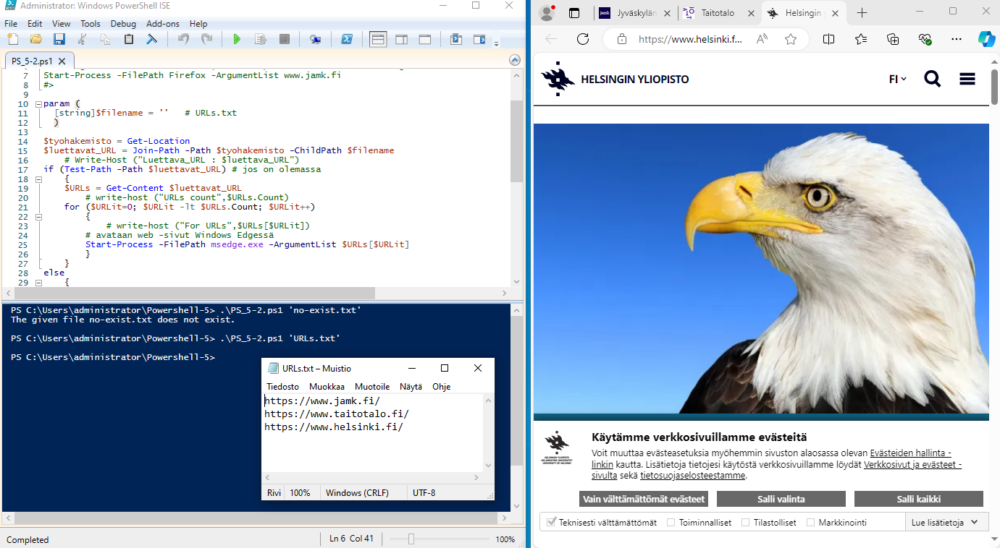
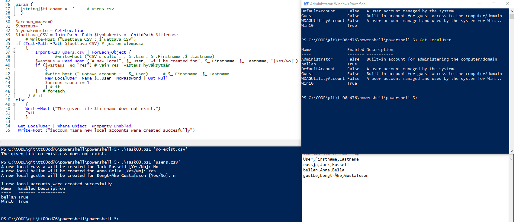
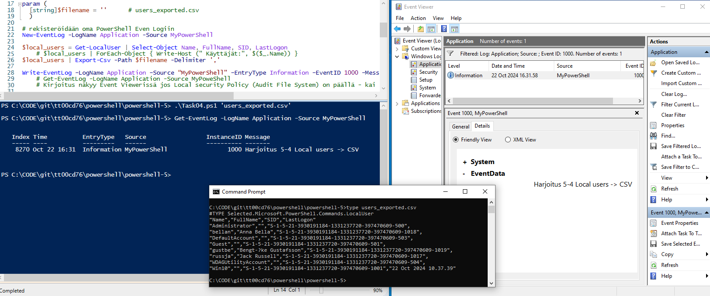
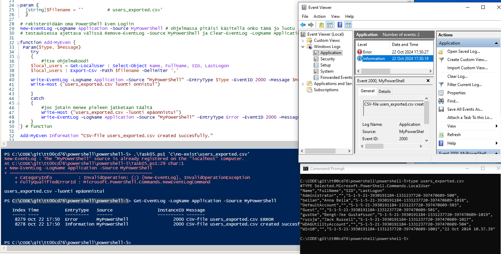

## PowerShell-5

### Task01

Create a script that creates new accounts for a placebo system (placebo means here that the system not really exists). 
The script takes one parameter **filename**. The parameter points to a csv file including user names.
(https://tt00cd76.pages.labranet.jamk.fi/Images/users.csv) Check first that the given file exist, then read all lines. 
User's account is created by taking first four characters of lastname and two characters of firstname. The account contains only lowercase letters. Give a message presented in the picture below. If the given file does not exist, the script will show an error message.

 

```
param (
  [string]$filename = ''  # users.csv
  )

$accoun_maara=0
$tyohakemisto = Get-Location
$luettava_CSV = Join-Path -Path $tyohakemisto -ChildPath $filename 
if (Test-Path -Path $luettava_CSV) # jos on olemassa
    {
        Import-Csv users.csv | ForEach-Object {
        write-host ("Hello my colleague", $_.Firstname ,$_.Lastname, "this is your new account:")
        # 4 char lastname
        for ($i=0; $i -lt 4; $i++) 
            { 
            $luotava_account += $_.Lastname[$i] 
            }
        # 2 char firstname
        $luotava_account += $_.Firstname[0] + $_.Firstname[1]     
        write-host $luotava_account.ToLower()
        $luotava_account=''
        $accoun_maara += 1
        } # foreach
    Write-Host ($accoun_maara, "new accounts created ") 
    }  # if
else
    {
    Write-Host ("The given file $filename does not exist.")
    }

```

---
### Task02

Create a script that opens all the given urls to a browser. 
The script has one parameter **filename**. The parameter points to a text file where urls are. 
Check first that the given file exist, then read all lines and open the urls in a browser. 
If the given file does not exist, the script will show a error message.

 

```
param (
  [string]$filename = ''   # URLs.txt
  )
  
$tyohakemisto = Get-Location
$luettavat_URL = Join-Path -Path $tyohakemisto -ChildPath $filename 
if (Test-Path -Path $luettavat_URL) # jos on olemassa
    {
    $URLs = Get-Content $luettavat_URL
    for ($URLit=0; $URLit -lt $URLs.Count; $URLit++)
        {
        # avataan web -sivut Windows Edgessä
        Start-Process -FilePath msedge.exe -ArgumentList $URLs[$URLit]
        }
    }
else
    {
    Write-Host ("The given file $filename does not exist.")
    }
 
```

---
### Task03

Create a script that creates new localusers by a given csv-file (https://tt00cd76.pages.labranet.jamk.fi/Images/users.csv). 
The script has one parameter **filename**. Check first that the given file exist, then read all lines and create a new local 
user account for every user in file. The account name is created same way as in the task 01. You can use in this script the 
parameter **NoPassword** Please remember: you have to run this script with Administrator privileges that you can use the 
New-LocalUser cmdlet. If the given file does not exist, the script gives a proper error message.
Please note: and you can delete creted local users after you have tested that your script is working. 
Please remember take a screenshot from your test run.

 

```
param (
  [string]$filename = ''     # users.csv
  )

$accoun_maara=0
$vastaus=''
$tyohakemisto = Get-Location
$luettava_CSV = Join-Path -Path $tyohakemisto -ChildPath $filename 
if (Test-Path -Path $luettava_CSV) # jos on olemassa
    {
        Import-Csv users.csv | ForEach-Object {
        $vastaus = Read-Host ("A new local", $_.User, "will be created for", $_.Firstname ,$_.Lastname, "[Yes/No]")
        if ($vastaus -eq "Yes") # vain Yes -vastaus hyväksytään
            {
            New-LocalUser -Name $_.User -NoPassword | Out-Null
            $accoun_maara += 1
            } # if
        }  # foreach
     } # if
else
    {
    Write-Host ("The given file $filename does not exist.")
    Exit
    }
 
 Get-LocalUser | Where-Object -Property Enabled
 Write-Host ("$accoun_maara new local accounts were created succesfully") 

```

---
### Task04

Create a script that writes information of all the local users in a computer to a CSV-file. 
The script has one parameter **filename**. The information includes local users's 1) name 2) full name 3) 
SID and 4) lastlogon.

 

```
param (
  [string]$filename = ''      # users_exported.csv
  )

# rekisteröidään oma PowerShell Even Logiin
New-EventLog -LogName Application -Source MyPowerShell
  
$local_users = Get-LocalUser | Select-Object Name, FullName, SID, LastLogon
    # $local_users | ForEach-Object { Write-Host (" Käyttäjät:", $($_.Name)) } 
$local_users | Export-Csv -Path $filename -Delimiter ','

Write-EventLog –LogName Application –Source “MyPowerShell” –EntryType Information –EventID 1000 –Message “Harjoitus 5-4 Local users -> CSV”


```

---
### Task05

In this task you have to create a new function called **Add-MyEvent**. 
The function takes two parameter: **Type** and **Message**. The type can be: Error, Warning, or Information. 
Message is a clear message. Add the following functionality to the task 04 using your new function.
- if the script can create a new CSV-file succesfully, then it will add a Information message to the eventlog. 
- if the script cannot create a file succesfully, then it adds a Error message to the eventlog.
Before using your new function create a new source named "MyPowerShell" to the Evenlog for writing your events.

 

```
param (
  [string]$filename = ''         # users_exported.csv'
  )

# rekisteröidään oma PowerShell Even Logiin
New-EventLog -LogName Application -Source MyPowerShell # ohjelmassa pitäisi käsitellä onko tämä jo luotu
# testauksessa ajettava välissä Remove-EventLog -Source MyPowerShell ja Clear-EventLog -LogName Application

function Add-MyEven {
 Param($Type, $Message) 
    try
    {
        #itse ohjelmakoodi
    $local_users = Get-LocalUser | Select-Object Name, FullName, SID, LastLogon
    $local_users | Export-Csv -Path $filename -Delimiter ','

    Write-EventLog -LogName Application -Source “MyPowerShell” –EntryType $Type –EventID 2000 –Message $Message
    Write-Host ("users_exported.csv luonti onnistui")

    }
    catch
    {
        #jos jotain menee pieleen jatketaan täältä
        Write-Host ("users_exported.csv -luonti epäonnistui")
        Write-EventLog -LogName Application -Source “MyPowerShell” –EntryType Error –EventID 2000 –Message “CSV-file users_exported.csv ERROR”
    }
} # function
  
Add-MyEven Information “CSV-file users_exported.csv created succesfully.”

```
